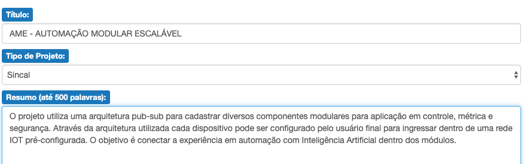

Projeto AME - Automação Modular Escalável
Engenharia de Computação - 2019, 4 Período FACIT.

> Projeto do XVII Seminário da Interdisciplinaridade do Cálculo desenvolvido na disciplina de Física, Programação e Introdução a Computação.

- Install NodeJS, Yarn, Platformio(Vscode or Atom), Mongo
- This project was made using esp32 and esp8266. The "heltec-nodes" uses C and "nodes" uses javascript. Be free to use the one it suits you better, for javascript you need to flash the firmware with espruino

> clone this repository, `cd sincal-ame` > `cd server`, `yarn`, `yarn start`

---

Made with love ♥ by Robert Veloso :wave:.
[Get in touch with me](https://www.linkedin.com/in/robertveloso/),
[or discord me!](https://discordapp.com/channels/@me/robertveloso#1547)
